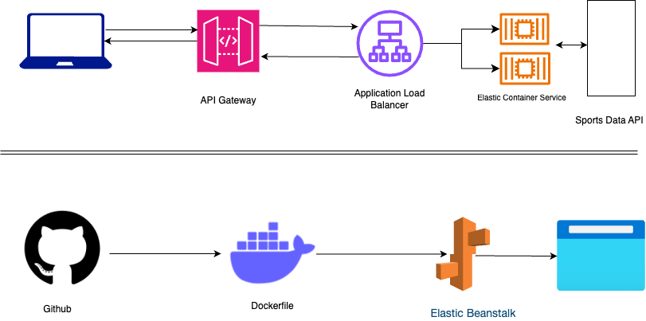
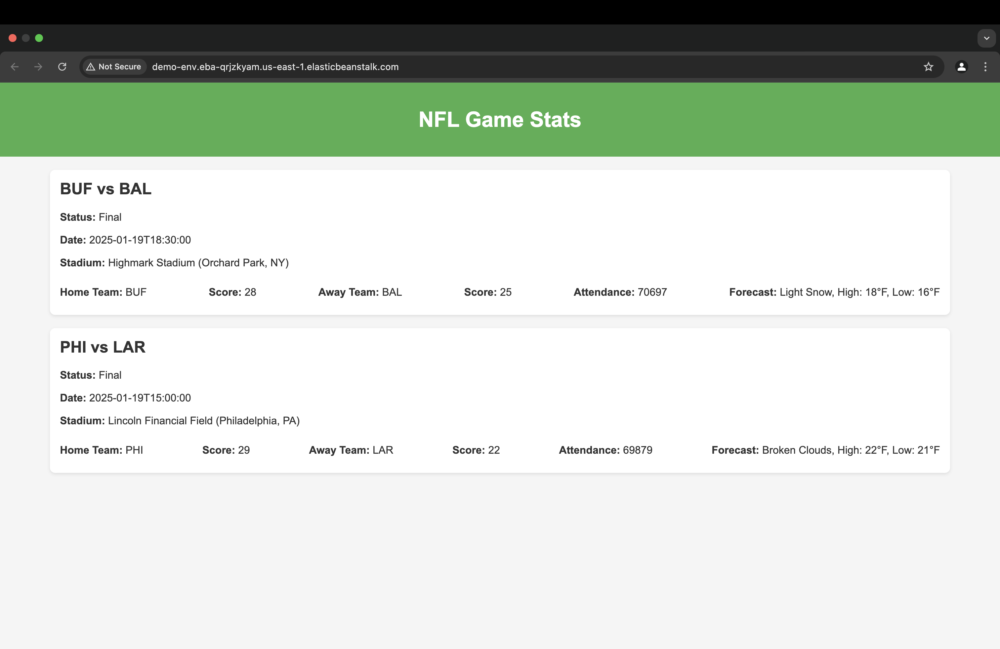

# Sports API Management System

## Project Overview
This project demonstrates building a containerized API management system for querying sports data. The system leverages **Amazon ECS (Fargate)** for running containers, **Amazon API Gateway** for exposing REST endpoints, and an external **Sports API** for real-time sports data. Additionally, an **index.html** file was integrated to render the API data into a human-readable web page. A new feature allows deployment using Elastic Beanstalk via a custom Dockerfile, enabling users to input their own API keys and dates for customized usage. A separate `ELB` folder will contain the dedicated Dockerfile for Elastic Beanstalk deployment.

---

## Technical Architecture



## Web page  


---

## Features
- Exposes a REST API for querying real-time sports data.
- Runs a containerized backend using Amazon ECS with Fargate.
- Scalable and serverless architecture.
- API management and routing using Amazon API Gateway.
- Added a web interface to display sports data in a user-friendly format.
- Elastic Beanstalk deployment option using a dedicated Dockerfile for easy setup.

---

## Learning Highlights
During this project, I learned and implemented:
1. Setting up a containerized application using **Docker**.
2. Deploying and managing containers on **Amazon ECS (Fargate)**.
3. Creating and managing REST APIs with **Amazon API Gateway**.
4. Integrating external APIs (Sports API) and handling real-time data.
5. Building a simple front-end using **HTML** to display API data.
6. Configuring **IAM roles** and **security groups** for secure operations.
7. Testing and debugging a multi-component architecture.
8. Implementing a deployment pipeline using **Elastic Beanstalk** for user-friendly setup via the AWS Management Console.

---

## Deployment Details

### Step 1: Cloning the Repository
```bash
git clone https://github.com/ifeanyiro9/containerized-sports-api.git
cd containerized-sports-api
```

### Step 2: Creating ECR Repository
```bash
aws ecr create-repository --repository-name sports-api --region us-east-1
```

### Step 3: Building and Pushing Docker Image
```bash
aws ecr get-login-password --region us-east-1 | docker login --username AWS --password-stdin <AWS_ACCOUNT_ID>.dkr.ecr.us-east-1.amazonaws.com

docker build --platform linux/amd64,linux/arm64 -t sports-api .
docker tag sports-api:latest <AWS_ACCOUNT_ID>.dkr.ecr.us-east-1.amazonaws.com/sports-api:sports-api-latest
docker push <AWS_ACCOUNT_ID>.dkr.ecr.us-east-1.amazonaws.com/sports-api:sports-api-latest
```

### Step 4: Setting Up ECS Cluster with Fargate
1. **Create an ECS Cluster**:
   - Go to the ECS Console → Clusters → Create Cluster.
   - Name your cluster (e.g., `sports-api-cluster`).
   - Select Fargate as the infrastructure, then create the cluster.

2. **Create a Task Definition**:
   - Add container details, including the image URI and port configuration.
   - Define environment variables, such as the Sports API key.

3. **Deploy the Service**:
   - Use an Application Load Balancer (ALB) to expose the service.
   - Configure health checks and security groups.

### Step 5: Configuring API Gateway
1. **Create a New REST API**:
   - Set up a resource `/`.
   - Create a GET method with an HTTP Proxy integration to the ALB.

2. **Deploy the API**:
   - Deploy the API to a stage (e.g., `test`).

### Step 6: Adding Frontend Integration
- Created an **index.html** file under the `templates/` directory.
- Integrated the HTML with Flask to fetch and display API data in a readable format.
- Updated the Flask application to serve the web page at the root endpoint (`/`).

### Step 7: Elastic Beanstalk Deployment Option
- Created a dedicated Dockerfile for Elastic Beanstalk deployment, placed in the `ELB/` folder.

## ELB Deployment
## 🐳 Dockerfile Details

The `Dockerfile` used for this application includes:
- **Base Image**: [e.g., ubuntu:22.04, Python:3.9-slim]
- **Dependencies Installation**: Installs all required libraries and dependencies.
- **Port Exposure**: Exposes the application port (e.g., `EXPOSE 8080`).
- **Application Start**: Specifies the command to start the application.

### Dockerfile
```dockerfile
# Use Ubuntu as the base image
FROM ubuntu:22.04

# Set environment variables for application
ENV APP_HOME=/app \
    PYTHONUNBUFFERED=1

# Set working directory
WORKDIR $APP_HOME

# Install required packages
RUN apt-get update && apt-get install -y \
    python3 \
    python3-pip \
    git && \
    apt-get clean && \
    rm -rf /var/lib/apt/lists/*

# Clone the repository
RUN git clone https://github.com/Het4304/30_Days_DEVOPS.git $APP_HOME

# Set working directory to the specific project folder
WORKDIR $APP_HOME/Project_4

# Install Python dependencies
RUN pip3 install --no-cache-dir -r requirements.txt

# Expose port 8080
EXPOSE 8080

# Define command to run the application
CMD ["python3", "app2.py"]
```

---

## 🚀 Hosting on AWS Elastic Beanstalk

### Steps to Deploy via AWS Management Console:

1. **Login to AWS Console:**
   - Navigate to the AWS Elastic Beanstalk service.

2. **Create a New Application:**
   - Click on "Create Application."
   - Enter the application name and select the platform (e.g., Docker).

3. **Upload Code:**
   - Upload the Dockerfile from your local machine.

4. **Configure Environment:**
   - Set environment variables and select instance type as needed (Free Tier).

5. **Deploy:**
   - Launch the application and monitor deployment progress.

6. **Access the Application:**
   - Once deployed, use the provided URL to access your application.

---

### Step 8: Testing the System
- Verified the API responses via API Gateway or Elastic Beanstalk.
- Checked the web interface for data display.
- Use `curl` or a web browser to access the application.

---

## Project Structure
```bash
Project_4/
├── templates/
│   └── index.html          # Frontend template for data rendering
├── ELB/
│   └── Dockerfile          # Dedicated Dockerfile for Elastic Beanstalk deployment
├── app.py                  # Flask application for querying sports data
├── app2.py                 # Flask application for displaying sports data
├── Dockerfile              # Dockerfile for ECS deployment
├── requirements.txt        # Python dependencies
├── .gitignore              # Ignored files for version control
└── README.md               # Project documentation
```

---

## Technologies Used
- **Cloud Provider**: AWS
- **Core Services**: Amazon ECS (Fargate), API Gateway, Elastic Beanstalk, Amazon ECR
- **Programming Language**: Python 3.x
- **Containerization**: Docker
- **IAM Security**: Custom least privilege policies for ECS task execution and API Gateway

---

This project allowed me to gain hands-on experience with cloud deployment, API integration, containerized architectures, and creating a user-friendly deployment pipeline using Elastic Beanstalk.